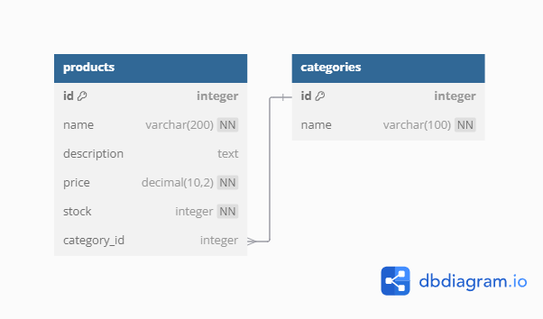

# 📦 ProductManager

**ProductManager** es una aplicación de gestión de productos y categorías desarrollada con **Django** y **Bootstrap**. Su objetivo es ofrecer una solución sencilla y eficiente para gestionar productos y categorías a través de una interfaz amigable.

---

## 🚀 Funcionalidades

- 🔍 **Gestión de Productos:**
  - Crear, editar, eliminar y listar productos.
  - Asociar productos con categorías existentes.
- 📂 **Gestión de Categorías:**
  - Crear, editar, eliminar y listar categorías.
  - Las categorías se pueden utilizar para clasificar productos.
- 🗂 **Relaciones entre tablas:**
  - Una categoría puede tener múltiples productos.

---

## 📋 Instalación

Sigue estos pasos para configurar y ejecutar el proyecto en tu máquina local:

### 1️⃣ Clonar el repositorio
```bash
$ git clone https://github.com/Jfgazonb20/ProductManager.git
$ cd ProductManager
```

### 2️⃣ Crear y activar un entorno virtual
```bash
$ python -m venv env
$ source env/bin/activate # En Windows: env\Scripts\activate
```

### 3️⃣ Instalar las dependencias
```bash
$ pip install -r requirements.txt
```

### 4️⃣ Aplicar migraciones
```bash
$ python manage.py makemigrations
$ python manage.py migrate
```

### 5️⃣ Cargar datos iniciales (opcional)
Si deseas trabajar con datos iniciales:
```bash
$ python manage.py loaddata initial_data.json
```

### 6️⃣ Ejecutar el servidor
```bash
$ python manage.py runserver
```

Navega a [http://127.0.0.1:8000/](http://127.0.0.1:8000/) para ver la aplicación en acción.

---

## 📂 Estructura del Proyecto

```plaintext
ProductManager/
├── ProductManager/    # Configuración principal de Django
├── categories/        # Aplicación para gestionar categorías
├── products/          # Aplicación para gestionar productos
├── sat_data/          # Aplicación para manejo de datos del SAT
├── dbDiagram/         # Diagramas de la base de datos
├── templates/         # Archivos HTML
├── static/            # Archivos CSS y JS
├── TécnicaMéxico.postman_collection.json   # Colección Postman para pruebas de APIs
├── requirements.txt   # Dependencias del proyecto
```
[Descargar TecnicaMexico Postman Collection](https://github.com/Jfgazonb20/DigitalMoneyHouseCol/raw/main/ProductManager/dbDiagram/TecnicaMexico.postman_collection.json)

---

## 🌐 Base de Datos

### 🗃 Modelo Relacional

El modelo relacional entre productos y categorías se representa de la siguiente manera:

```plaintext
categories_category
├── id (PK)
└── name

products_product
├── id (PK)
├── name
├── description
├── price
├── stock
├── category_id (FK -> categories_category.id)
```

### 🖼 Diagrama Visual



Si deseas editar o visualizar el modelo, usa [DBDiagram](https://dbdiagram.io/) con el siguiente código:

```dbml
table categories_category {
  id int [pk]
  name varchar
}

table products_product {
  id int [pk]
  name varchar
  description text
  price decimal
  stock int
  category_id int [ref: > categories_category.id]
}
```

---

## 🎨 Tecnologías Usadas

- **Backend:** Django 4.x
- **Frontend:** Bootstrap 5
- **Base de Datos:** SQLite (por defecto, configurable a MySQL o PostgreSQL)
- **APIs:** Django REST Framework

---

## 👨‍💻 Contribuciones

¡Las contribuciones son bienvenidas! Si deseas mejorar este proyecto:
1. Haz un fork del repositorio.
2. Crea una rama para tu funcionalidad o fix:
   ```bash
   $ git checkout -b feature/nueva-funcionalidad
   ```
3. Realiza tus cambios y haz commit:
   ```bash
   $ git commit -m "Descripción de tus cambios"
   ```
4. Haz un push a tu rama:
   ```bash
   $ git push origin feature/nueva-funcionalidad
   ```
5. Crea un Pull Request desde GitHub.

---

## 📞 Contacto

Si tienes preguntas o sugerencias, puedes contactarme en:
- GitHub: [Jfgazonb20](https://github.com/Jfgazonb20)
- Email: [jfgazonb@gmail.com](mailto:jfgazonb@gmail.com)

---

¡Gracias por utilizar **ProductManager**! 🎉
